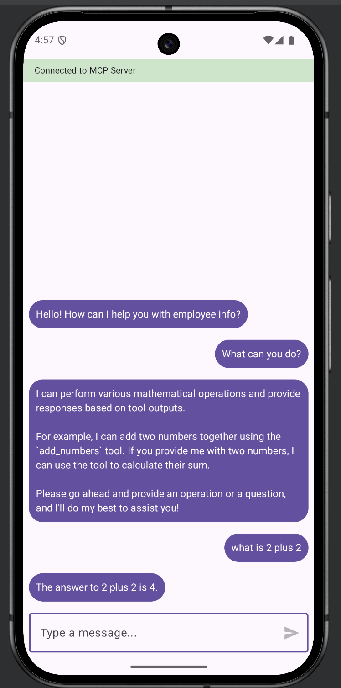
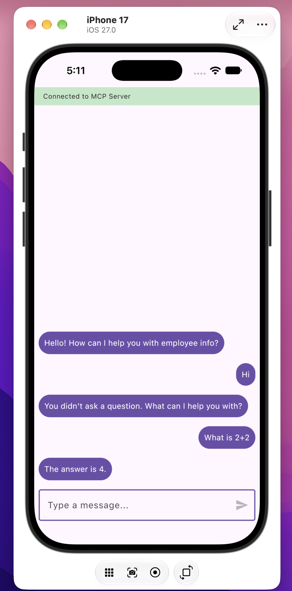
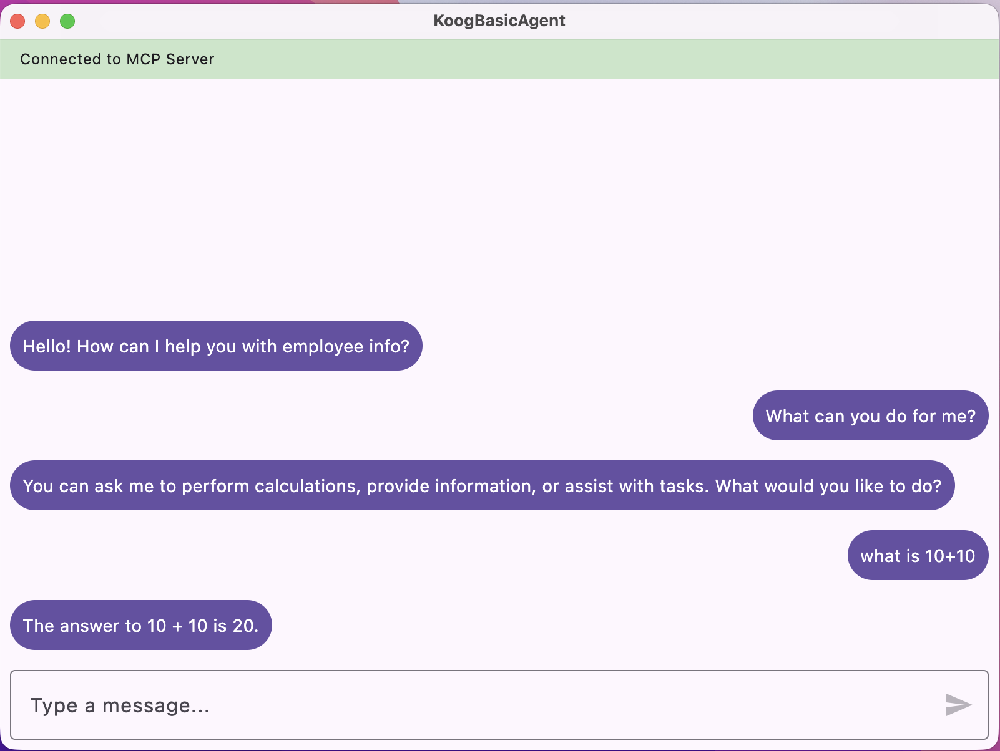
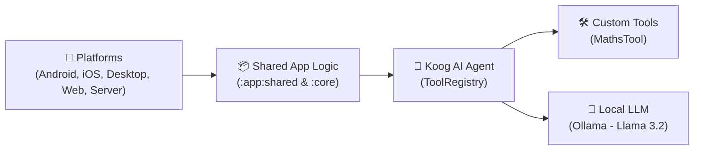

# KoogBasicAgent 🤖

A comprehensive **Kotlin Multiplatform (KMP)** project demonstrating how to build, configure, and deploy AI Agents using the **Koog AI Framework** across multiple target platforms (**Android**, **iOS**, **Desktop JVM**, **Web Wasm/JS**, and **Ktor Server**).

This project serves as an open-source template and educational demo for teaching AI Agent development, custom Tool registration, and Local LLM integration with **Ollama**.

---

## 📱 Screenshots

| Android | iOS | Desktop (JVM) |
| :---: | :---: | :---: |
|  |  |  |

---

## 📐 Architecture Flow



---

## 📚 Libraries Implemented

Here is a summary of all key libraries and frameworks implemented in this project:

| Category | Library Module | Description |
| :--- | :--- | :--- |
| **AI Framework** | `ai.koog:koog-agents` (`1.2.0`) | Core Koog framework for `AIAgent`, tool execution, prompt management, and lifecycle events. |
| **AI Extensions** | `ai.koog:koog-agents-additions` (`1.2.0-beta`) | Supplemental utilities and extensions for Koog agents. |
| **UI Framework** | `org.jetbrains.compose.*` (`1.13.0-alpha01`) | Compose Multiplatform UI framework (`runtime`, `foundation`, `material3`, `ui`, `components-resources`). |
| **Serialization** | `kotlinx-serialization-json` | Provides JSON encoding/decoding and type-safe argument metadata mapping for LLM tools. |
| **Concurrency** | `kotlinx-coroutines-core` / `swing` | Asynchronous coroutine support for model execution and UI thread safety. |
| **HTTP Client** | `ai.koog:koog-http-client-ktor` | Ktor-backed HTTP client factory for model communication across mobile, web, and desktop. |
| **Server Backend** | `io.ktor:ktor-server-*` (`3.5.2`) | Ktor Netty embedded server powering the backend microservice (`:server`). |
| **Android Integration**| `androidx.activity:activity-compose` / `lifecycle` | Android activity hosting and lifecycle-aware ViewModel support. |

---

## 🛠 Tool Creation

Tools allow your AI agent to extend its capabilities by executing local Kotlin code functions. In Koog, creating a tool requires two main steps:

### 1. Define Argument Data Class
Annotate the input data class with `@Serializable` and use `@param:LLMDescription` so the LLM understands what arguments to provide.

### 2. Implement `Tool<Args, Result>`
Extend `Tool<Args, Result>`, passing `typeToken<Args>()` and `typeToken<Result>()` to retain generic type information at runtime.

```kotlin
package dev.ell.koogbasicagent

import ai.koog.agents.core.tools.Tool
import ai.koog.agents.core.tools.annotations.LLMDescription
import ai.koog.serialization.typeToken
import kotlinx.serialization.Serializable

// Step 1: Define argument structure with descriptions for the LLM
@Serializable
data class MathArgs(
    @param:LLMDescription("The first number")
    val a: Double,
    @param:LLMDescription("The second number")
    val b: Double
)

// Step 2: Implement custom tools
object MathsTool {
    val add = object : Tool<MathArgs, Double>(
        argsType = typeToken<MathArgs>(),
        resultType = typeToken<Double>(),
        name = "add_numbers",
        description = "Adds two numbers together. Use this for ANY addition."
    ) {
        override suspend fun execute(args: MathArgs): Double {
            println(">> MathsTool: Adding ${args.a} + ${args.b}")
            return args.a + args.b
        }
    }

    val multiply = object : Tool<MathArgs, Double>(
        argsType = typeToken<MathArgs>(),
        resultType = typeToken<Double>(),
        name = "multiply_numbers",
        description = "Multiplies two numbers together. Use this for ANY multiplication."
    ) {
        override suspend fun execute(args: MathArgs): Double {
            println(">> MathsTool: Multiplying ${args.a} * ${args.b}")
            return args.a * args.b
        }
    }

    val all = listOf(add, multiply)
}
```

---

## ⚙️ Agent Configuration and Tool Registration

The `AIAgent` orchestrates conversations, tool selection, and model execution.

1. **Tool Registration**: Register custom tools using `ToolRegistry { tools(...) }`.
2. **Platform Prompt Executor**: Supply a platform-tailored `PromptExecutor` (e.g. connecting to Ollama at `http://10.0.2.2:11434` for Android Emulators or `http://localhost:11434` for Desktop/Web).
3. **Model & System Prompt**: Specify the LLM model (e.g. `OllamaModels.Meta.LLAMA_3_2_3B`) and explicit system prompt rules governing tool usage.
4. **Feature Installation**: Attach features like `EventHandler` to log tool calls or track performance.

```kotlin
package dev.ell.koogbasicagent

import ai.koog.agents.core.agent.AIAgent
import ai.koog.agents.core.tools.ToolRegistry
import ai.koog.agents.features.eventHandler.feature.EventHandler
import ai.koog.prompt.executor.ollama.client.OllamaModels

class AgentProvider {
    fun provideAgent(): AIAgent<String, String> {

        // 1. Register tools in ToolRegistry
        val toolRegistry = ToolRegistry {
            tools(MathsTool.all)
        }

        // 2. Instantiate and configure AIAgent
        val agent = AIAgent(
            toolRegistry = toolRegistry,
            promptExecutor = getPlatform().promptExecutor,
            llmModel = OllamaModels.Meta.LLAMA_3_2_3B,
            systemPrompt = """
                You are a helpful assistant.

                TOOL USAGE RULES:
                - You MUST use the `add_numbers` tool for any addition and the `multiply_numbers` tool for any multiplication.
                - Do NOT calculate these yourself. Use the tools to ensure accuracy.
                - If a tool is not relevant to the request, answer the user directly.
                - Do not expose tool metadata, internal reasoning, or tool details in your final response.
            """.trimIndent()
        ) {
            // 3. Install event handlers for observing agent activity
            install(EventHandler) {
                onToolCallStarting { ctx ->
                    println(">> Calling tool: ${ctx.toolName} with args ${ctx.toolArgs}")
                }
            }
        }

        return agent
    }
}
```

### Execution Log Example

When a user asks: *"What is 3 + 5 and 10 * 10?"*, the agent logs:

```text
>> Calling tool: add_numbers with args {"a":3, "b":5}
>> MathsTool: Adding 3.0 + 5.0
>> Calling tool: multiply_numbers with args {"a":10, "b":10}
>> MathsTool: Multiplying 10.0 * 10.0
```

---

## 🏃 Commands to Run Each Platform

### Prerequisites
Before running any target platform, make sure **Ollama** is installed and running locally with the Llama 3.2 model:

```bash
ollama run llama3.2
```

### Platform Commands

| Target Platform | Command / Action | Description |
| :--- | :--- | :--- |
| **Android** | `./gradlew :app:androidApp:installDebug` | Builds and installs the debug APK on an attached Android device or emulator. |
| **Desktop (JVM)** | `./gradlew :app:desktopApp:run` | Launches the Compose Desktop desktop application. |
| **Server (Ktor)** | `./gradlew :server:run` | Starts the Ktor embedded Netty web server on `http://localhost:8080`. |
| **Web (Wasm)** | `./gradlew :app:webApp:wasmJsBrowserDevelopmentRun` | Starts local dev server for WebAssembly target (opens in browser). |
| **Web (JS)** | `./gradlew :app:webApp:jsBrowserDevelopmentRun` | Starts local dev server for Kotlin/JS target (opens in browser). |
| **iOS** | Open `/app/iosApp` in **Xcode** | Build and run on iOS Simulator or connected iOS device via Xcode. |

---

## 🧪 Commands to Run Tests

Execute unit tests across shared logic and server modules:

| Target Environment | Command |
| :--- | :--- |
| **Android Shared Host Tests** | `./gradlew :app:shared:testAndroidHostTest` |
| **Desktop (JVM) Shared Tests**| `./gradlew :app:shared:jvmTest` |
| **Server Tests** | `./gradlew :server:test` |
| **Web (Wasm) Shared Tests** | `./gradlew :app:shared:wasmJsTest` |
| **iOS Simulator Tests** | `./gradlew :app:shared:iosSimulatorArm64Test` |

---

## 📁 Project Structure

```text
KoogBasicAgent/
├── core/                  # Common core models and Koog framework integration
├── app/
│   ├── shared/            # Shared Compose Multiplatform UI & AgentProvider business logic
│   ├── androidApp/        # Android activity entry point
│   ├── desktopApp/        # Desktop (JVM) window entry point
│   └── webApp/            # Web (Wasm / JS) browser entry point
└── server/                # Ktor backend server
```

---

## 📚 Resources

- [Koog AI Framework Documentation](https://koog.ai)
- [Kotlin Multiplatform Documentation](https://www.jetbrains.com/help/kotlin-multiplatform-dev/get-started.html)
- [Compose Multiplatform Documentation](https://kotlinlang.org/compose-multiplatform/)
- [Ollama Quickstart Guide](https://docs.ollama.com/quickstart)

